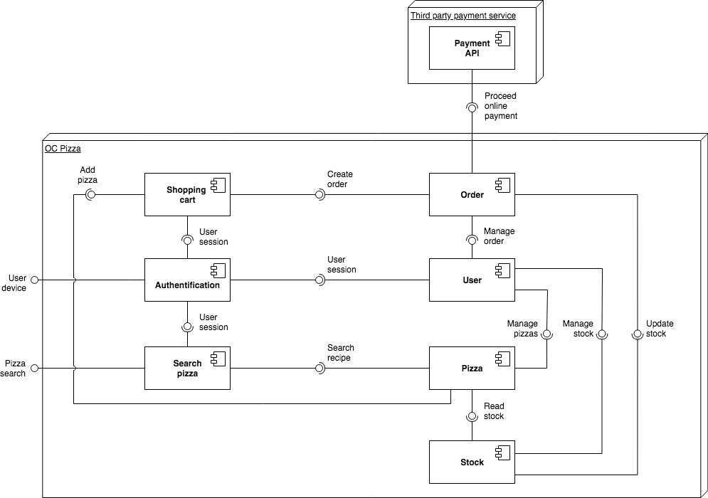
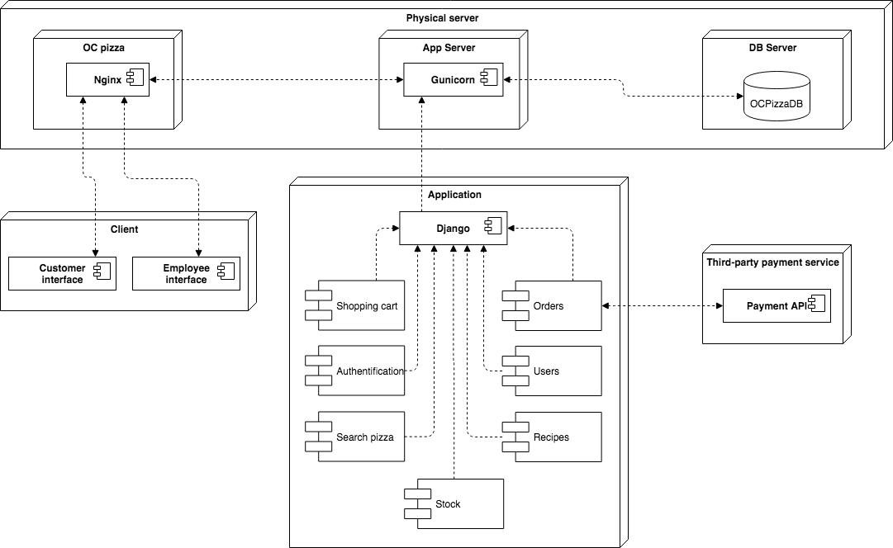
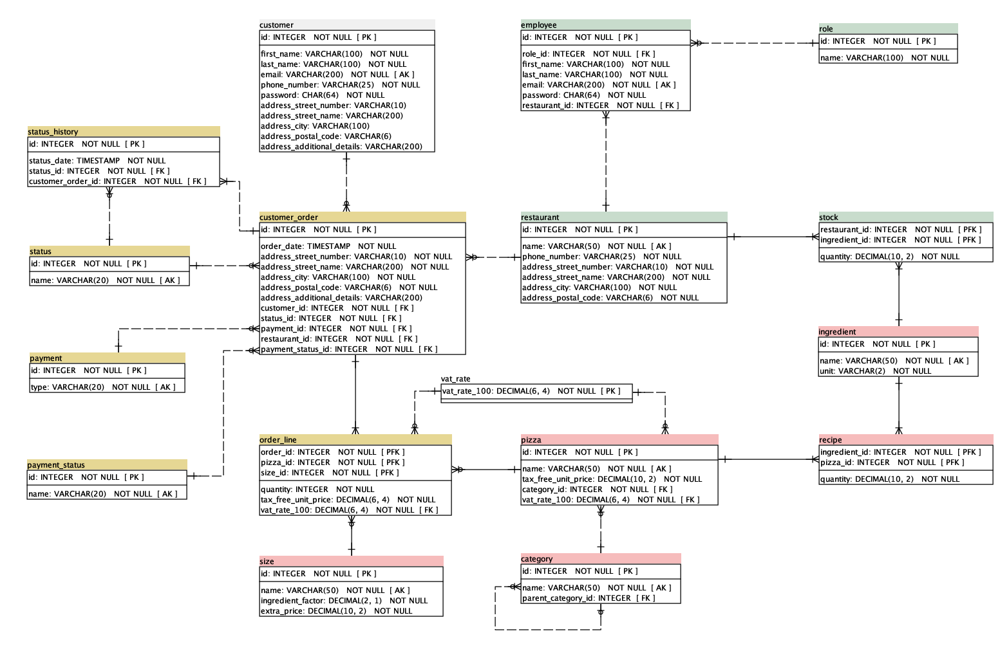

\renewcommand{\contentsname}{Sommaire}
\tableofcontents

\pagebreak
# I. Contexte

Notre client OC Pizza souhaite mettre en place un système informatique déployé pour l'ensemble de ses pizzeria actuelles et futures.

Le but de ce projet est de définir le domaine fonctionnel de ce futur système mais aussi de concevoir l'architecture technique de la solution.
Pour cela, nous avons :

- modélisé les objets du domaine fonctionnel grâce à un diagramme de classe UML,
- identifié les composants de ce système par le biais d'un diagramme de composants,
- définie le déploiement de ces différents composants dans un diagramme de déploiement,
- puis élaboré un schéma de la base de données avec un modèle physique de données.

\pagebreak
# II. Description du domaine fonctionnel

\pagebreak
# III. Relations entre les classes

Le but des descriptions ci-après est d'expliquer les liaisons entre les différentes classes du diagramme de classes.
A noté que pour une uniformisation par la suite avec le modèle physique de données, les noms des classes ainsi que leurs attributs sont décrits en anglais.

## `Customer` - `Address`

- `Customer` représente un·e client·e du site OC Pizza.
- `Address` représente l'adresse postale du / de la client·e.

Le·a client·e est associé·e à zéro ou une adresse. Une adresse est associée à zéro, un·e ou plusieurs client·e·s.

## `Customer` - `CustomerOrder`

- `Customer` représente un·e client·e du site OC Pizza.
- `CustomerOrder` représente la commande passée par le·a client·e.

Un·e client·e est associé·e à zéro, une ou plusieurs commandes. Une commande est associée à exactement un·e client·e.

## `CustomerOrder` - `Address`

- `CustomerOrder` représente la commande passée par le·a client·e.
- `Address` représente l'adresse postale de livraison.

Une commande est associée à une seule adresse de livraison. Une adresse est associée à zéro, une ou plusieurs commandes.

## `CustomerOrder` - `Restaurant`

- `CustomerOrder` représente la commande passée par le·a client·e.
- `Restaurant` représente le restaurant en charge de la préparation de la commande.

Une commande est associée à exactement un restaurant. Un restaurant est associé à zéro, une ou plusieurs commandes

## `CustomerOrder` - `OrderLine`

- `CustomerOrder` représente la commande passée par le·a client·e.
- `OrderLine` représente une ligne détaillée de la commande.

Une commande est associée à une ou plusieurs lignes de commande. Une ligne de commande est associée à exactement une commande.

## `CustomerOrder` - `Payment`

- `CustomerOrder` représente la commande passée par le·a client·e.
- `Payment` représente le type de payement utilisé par le·a client·e (CB à la livraison, en ligne, en espèces, etc.).

Une commande est associée à exactement un type de payement. Un payement est associé à zéro, une ou plusieurs commandes.

## `CustomerOrder` - `PaymentStatus`

- `CustomerOrder` représente la commande passée par le·a client·e.
- `PaymentStatus` représente le statut du payement de la commande (en attente, payée, etc.).

Une commande est associée à un seul statut de payement. Un statut de payement pourra être associé à zéro, une ou plusieurs commandes.

## `CustomerOrder` - `StatusHistory` - `Status`

- `CustomerOrder` représente la commande passée par le·a client·e.
- `Status` représente le statut de la commande (en attente, en préparation, en livraison, etc.).
- `StatusHistory` représente l'historique des statuts de commande.

Une commande est associée à exactement un statut. Un statut est associé à zéro, une ou plusieurs commandes.
L'historique des statuts de commande est une classe d'association qui permet d'ajouter un attribut à l'association entre la commande et le statut de la commande.

## `OrderLine` - `Pizza`

- `OrderLine` représente une ligne détaillée de la commande.
- `Pizza` représente une pizza.

Une ligne de commande est associée à exactement une statut. Une pizza est associée à zéro, une ou plusieurs lignes de commandes.

## `OrderLine` - `Size`

- `OrderLine` représente une ligne détaillée de la commande.
- `Size` représente une taille de pizza.

Une ligne de commande est associée à exactement une taille de pizza. Une taille de pizza est associée à zéro, une ou plusieurs lignes de commandes.

## `OrderLine` - `VatRate`

- `OrderLine` représente une ligne détaillée de la commande.
- `VatRate` représente le taux de TVA applicable à la ligne de commande.

Une ligne de commande est associée à exactement un taux de TVA. Un taux de TVA est associé à zéro, une ou plusieurs lignes de commandes.

## `Pizza` - `VatRate`

- `Pizza` représente une pizza.
- `VatRate` représente le taux de TVA applicable à la ligne de commande.

Une pizza est associée à exactement un taux de TVA. Un taux de TVA est associé à zéro, une ou plusieurs pizzas.

## `Pizza` - `Category`

- `Pizza` représente une pizza.
- `Category` représente la catégorie à laquelle appartient une pizza.

Une pizza est associée à exactement une catégorie. Une catégorie est associée à zéro, une ou plusieurs pizzas.

La classe `Category` présente la particularité d'avoir une association réflexive car la catégorie peut avoir un catégorie parente.
Ainsi une sous-catégorie est associée à zéro ou une catégorie parente. Une catégorie parente est associée à zéro, une ou plusieurs sous-catégories.

## `Pizza` - `Recipe` - `Ingredient`

- `Pizza` représente une pizza.
- `Ingredient` représente un ingrédient utilisable dans une pizza.
- `Recipe` représente une quantité nécessaire pour une pizza et un ingrédient donné.

Une pizza est associée à un ou plusieurs ingrédients. Un ingrédient est associé à une ou plusieurs pizzas.
La recette est une classe d'association qui permet d'ajouter un attribut à l'association entre la pizza et l'ingrédient.

## `Restaurant` - `Stock` - `Ingredient`

- `Restaurant` représente un restaurant.
- `Ingredient` représente un ingrédient utilisable dans une pizza.
- `Stock` représente une quantité en stock pour un restaurant et un ingrédient donné.

Un restaurant est associé à un ou plusieurs ingrédients. Un ingrédient est associé à un ou plusieurs restaurants.
Le stock est une classe d'association qui permet d'ajouter un attribut à l'association entre le restaurant et l'ingrédient.

## `Restaurant` - `Employee`

- `Restaurant` représente un restaurant.
- `Employee` représente un·e employé·e du restaurant.

Un restaurant est associé à un·e ou plusieurs employé·e·s. Un·e employé·e est associé·e à exactement un restaurant.

## `Restaurant` - `Address`

- `Restaurant` représente un restaurant.
- `Address` représente l'adresse postale du restaurant.

Le restaurant est associé à exactement une adresse. Une adresse est associée à zéro, un ou plusieurs restaurants.

## `Employee` - `Role`

- `Employee` représente un·e employé·e du restaurant.
- `Role` représente le rôle de l'employé·e au sein du restaurant (pizzaiolo, livreur·se, etc).

Un·e employé·e est associé·e à exactement un rôle. Un rôle est associé à zéro, un·e ou plusieurs employé·e·s.

\pagebreak
# IV. Composants du système

Le diagramme ci-dessus décrit les composant du système ainsi que les composants externes utilisés.

## `Authentification`

Composant pour l'authentification des utilisateur·rice·s (client·e ou employé·e). Au moment de cette connexion un rôle lui sera attribué. Ce rôle lui permettra d'avoir la permission de faire certaines opérations sur l'application.

## `User`

Composant pour la gestion des informations de l'utilisateur·rice.
Si l'utilisateur·rice est un responsable de restaurant il·elle pourra gérer les information des employé·es de son restaurant.

## `Pizza`

Composant pour la gestion des pizzas (nom, recettes, tailles) proposées par OC pizza. Ce composant est consulté lors que le·a client·e fait une recherche.
Pour toujours proposer des produits disponibles, le composant consulte l'état du stock du restaurant chargé de la confection de la commande.

## `Stock`

Composant pour la gestion des ingrédients disponibles dans chaque restaurant.
Le·a responsable du restaurant pourra en plus gérer le stock (mettre à jour suite aux livraisons, surveiller les quantités, etc.)

## `Order`

Composant pour gérer la ou les commande·s du ou de la client·e. Le·a client·e pourra visualiser l'historique de ses commandes et modifier, si elle est en attente de préparation, sa commande.
Les employé·es du restaurant pourront visualiser les commandes en attente dans le restaurant et les gérer (pour la préparation, la livraison, etc.)
C'est grâce à ce composant que l'adresse de livraison sera renseignée.

## `Shopping cart`

Composant pour créer et gérer un panier avant de passer la commande.

## `Search pizza`

Composant pour rechercher une pizza parmi la liste des pizzas proposées.

## `Payment API`

Composant pour gérer les paiements en ligne. Ce composant est un composant externe fournis par un prestataire spécialisé (par exemple : **[PayZen by Lyra](https://payzen.eu/api-rest/))**

\pagebreak
# V. Organisation des composants

La solution est déployée sur un serveur physique contenant trois serveurs virtuels.

- Les utilisateur·rice·s interagiront avec un serveur utilisant `Nginx`.
- L'application sera déployée sur un serveur utilisant `Gunicorn`. Cette application sera réalisée à l'aide du framework Django.
- Le troisième serveur sera la base de données relationnelles MySQL qui communiquera uniquement avec le serveur d'application.

\pagebreak
# VI. Modèle physique de données

