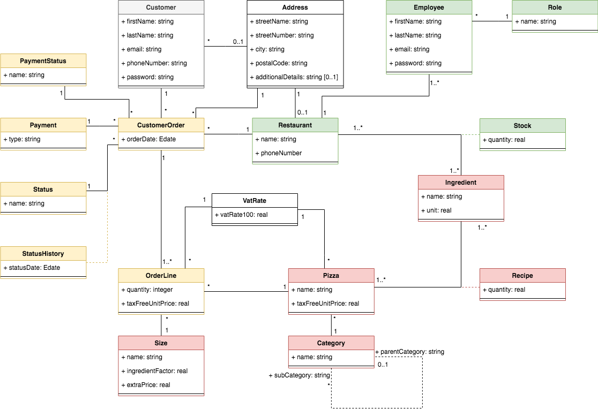
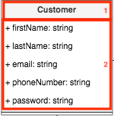
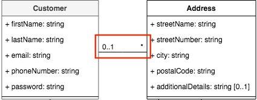
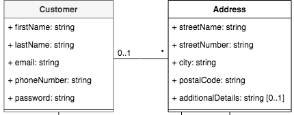
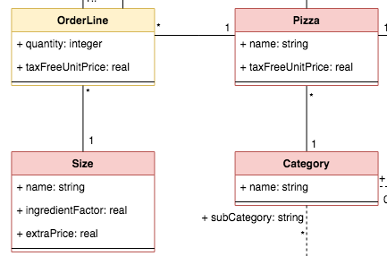
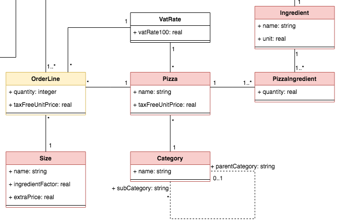
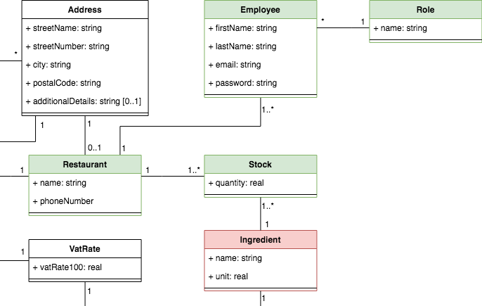

# I. Contexte

Notre client OC Pizza souhaite mettre en place un système informatique déployé pour l'ensemble de ses pizzeria actuelles et futures.

Le but de ce projet est de définir le domaine fonctionnel de ce futur système mais aussi de concevoir l'architecture technique de la solution.
Pour cela, nous avons :

- modélisé les objets du domaine fonctionnel grâce à un diagramme de classe UML,
- identifié les composants de ce système par le biais d'un diagramme de composants,
- définie le déploiement de ces différents composants dans un diagramme de déploiement,
- puis élaboré un schéma de la base de données avec un modèle physique de données.

\pagebreak
# II. Spécifications techniques

## II.1. Domaine fonctionnel

### II.1.1 Généralités

Le diagramme de classe se lit de la manière suivante.
Les classes sont représentées par des rectangles décomposés, ici, en deux parties:

1. En premier nous avons le nom de la classe.
2. En deuxième nous avons les attributs de la classe.

{ width=20% }

Ensuite les classes sont reliées entre elles par des association, matérialisées par un segment.
Ces associations sont complétées par des multiplicitées représentées à chaque extrémité de l'association. Ces multiplicitées permettent de déterminer combien d'instances d'une classe peuvent être lièes avec une instance de l'autre classe.
Les multiplicitées utlisées dans ce projet sont les suivantes :

- aucune ou une seul instance -> `0..1`,
- exactement une instance -> `1`,
- au moins une instance -> `1..*`,
- aucune, une ou plusieurs instances -> `*`.

{ width=50% }

### II.1.2 Détails

Dans le cadre de notre projet, le diagramme de classe est découpé en cinq catégories de classes :

- le client d'OC pizza (classe de couleur grise),
- la commande (classes de couleur jaune),
- la pizza (classes de couleur rouge),
- le restaurant (classes de couleur verte),
- sans catégorie (classes sans couleur)

La classe `Customer` permet de créer un profil client composé d'informations permettant son identification (prénom, nom, email, numéro de téléphone, etc.)
Cette classe est associée à la classe `Address` permettant au client de renseigner dans son profil une adresse principale (falcutative).

{ width=50% }

La classe `CustomerOrder` permet au client de créer une commande identifiée par une date.
Elle est associée aux classes suivantes :

- `PaymentStatus` qui définit les statuts de payement,
- `Payment` qui définit les différents types de payements,
- `Status` qui définit les status possible de commande,
- `StatusHistory` qui créée un historique des status de commande,
- `OrderLine` qui décompose la commande en un ensemble de ligne (une ligne = une pizza),
- `Address` utilisée pour définir l'adresse de livraison de la commande,
- `Restaurant` pour déterminer le restaurant en charge de la préparation de la commande,
- et `Customer` qui associe le client à l'origine de la commande.

Une ligne de commande (classe `OrderLine`) permet de préciser plusieurs informations concernant la pizza commandée :

- la quantité désirée grâce à l'attribut `quantity`,
- le prix unitaire hors taxe "figé" avec l'attribut `taxFreeUnitPrice`,
- la taille de la pizza en association avec la classe `Size`,
- et la pizza choisie par le client grâce à la classe `Pizza`.

{ width=50% }

La classe `Pizza` permettra de définir les caractéristique du produit :

- son nom avec l'attribut `name`,
- son prix unitaire hors taxe grâce à l'attribut `taxFreeUnitPrice`,
- sa catégorie avec la classe associée `Category`,
- et sa recette avec la classe `PizzaIngredient`.

Les ingrédients utilisés pour les recettes sont définis avec la classe `Ingredient`. Elle est associé aux classes `PizzaIngredient` (qui permet de créer les recettes de pizzas) et `Stock` (qui permet de gérer les stocks de chaque restaurant).

{ width=60% }

La pizzeria définie grâce à la classe `Restaurant` contiendra les informations suivantes :

- son nom avec l'attribut `name`,
- le numéro de téléphone grâce à l'attribut `phoneNumber`,
- une adresse en association avec la classe `Address`,
- les employées définis par la classe `Employee`,
- et le stock d'ingrédients grâce à la classe `Stock`.

Pour finir, la classe `Employee` permet la création d'employés rattaché à un restaurant en particulier. Les informations contenues dans la classe sont similaires à celles d'un client. Cependant, une classe `Role` est aussi associée pour que chaque employé puisse avoir un rôle défini (responsable, pizzaiolo, livreur, etc.)

{ width=60% }
